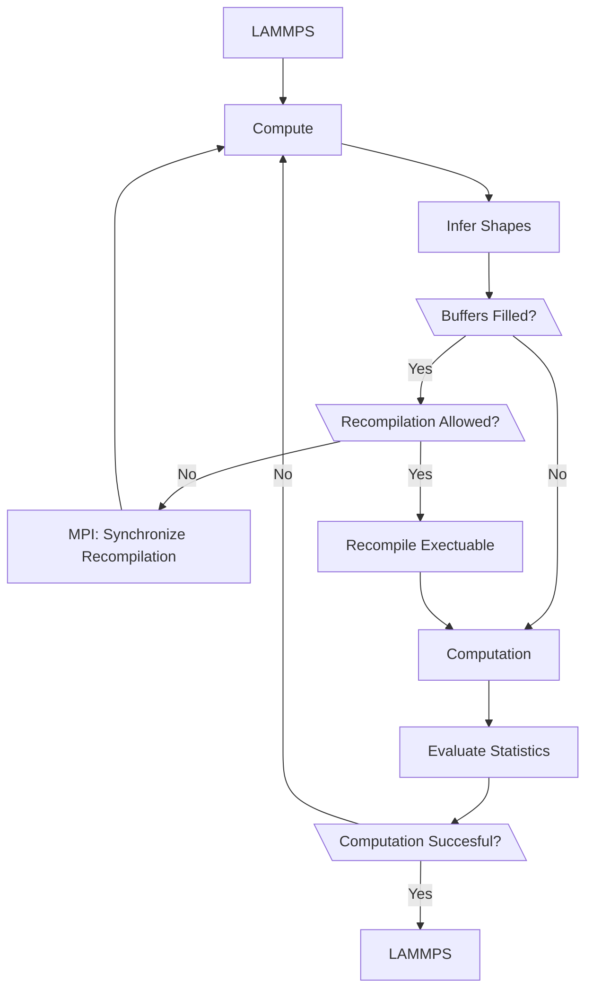

Developer Information
=====================

The flowchart below outlines the steps performed by the interface.

In LAMMPS, each MPI rank calls the compute function individually.
First, the compute function infers the shapes of the buffers for the atom
data and the neighbor list. If the buffers overflow, a recompilation of the
exectuable is requested.

To enforce parallel recompilations at the same time step, the first
call to the compute function does not allow recompilation.
However, if one device requires a recompilation, this request is synchrinized
to all other devices through LAMMPS and MPI.
Then, all devices can recompile their executable if the buffers are close
to beeing filled.

After a successful recompilation, or if no recompilation is required, the
data is copied to the device and the forces are computed.
The computation returns the forces and additional statistics.
These statistics might contain additional information about internal buffers,
which can overflow.
Therefore, the computation can be repeated with increased internal buffers
if necessary.

If no buffer overflowed during the computation, the interface return the
results to LAMMPS.

